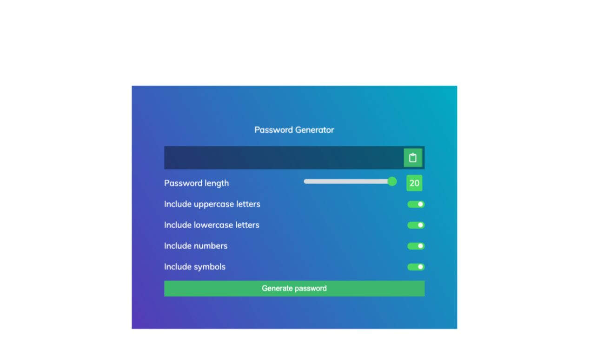

## Overview
This tool will allow you to automatically generate a passwords based on guidelines that you set to create strong and unpredictable passwords for each of your accounts.

## What's a strong password anyway?
Long: The longer a password, the more secure it is. A strong password should be at least 12 characters long.

Random: Strong passwords use a combination of letters, numbers, cases, and symbols to form an unpredictable string of characters that doesn't resemble words or names.

Unique: A strong password should be unique to each account to reduce vulnerability in the event of a hack.
